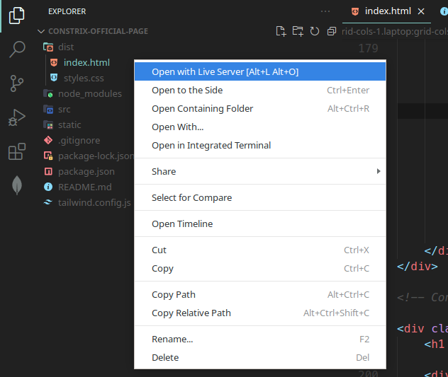

# Open Live server

Now, let's install the live-server script to make testing easier and more convenient for you. on your vscode install the extenstion:
>https://open-vsx.org/extension/ritwickdey/LiveServer

just simply search this name on your vscode, then install.

## Open live-server

finally right click `./dist/index.html` -> `Open with Live Server`

